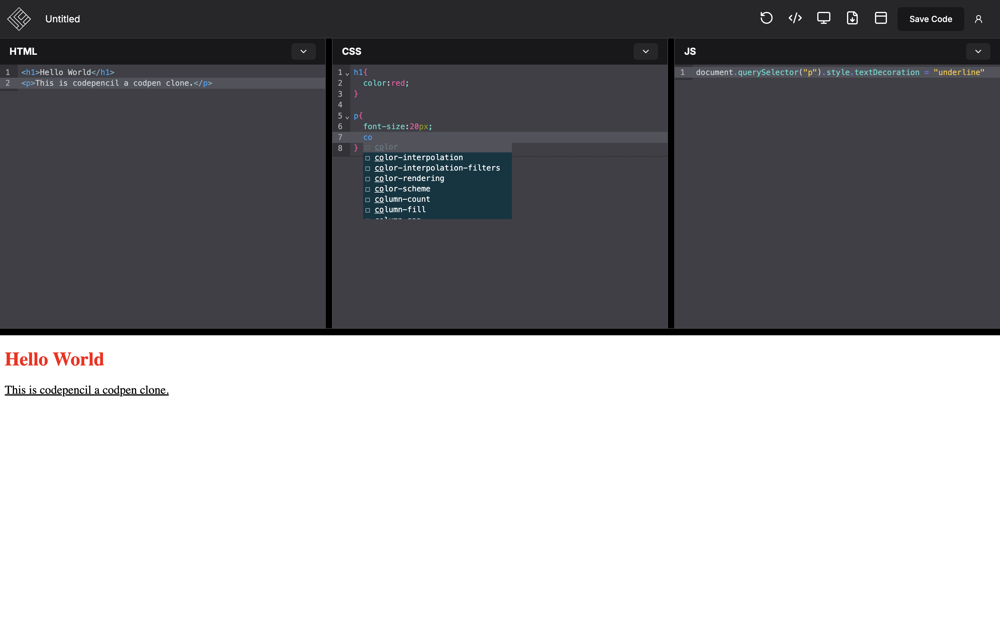
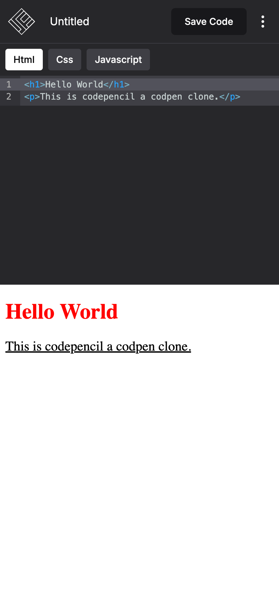

# CodePencil

CodePencil is a CodePen clone that allows users to write and preview HTML, CSS, and JavaScript code in real time. The project is built using **Next.js**, **Shadcn**, and **Firebase** for authentication and data storage, making it a modern and scalable code-sharing platform.


## About the Project

CodePencil aims to provide an intuitive, user-friendly environment for developers to create, save, and share their coding projects. It features live code previews, multiple project management, and a simple and clean interface.

## Features

- **Live Code Editor**: Write and preview HTML, CSS, and JavaScript in real time.
- **Autocomplete**: Provides code suggestions and autocomplete for HTML, CSS, and JavaScript, enhancing the coding experience.
- **Multiple Projects**: Users can create and manage multiple projects.
- **Firebase Authentication**: Secure login with Google and GitHub.
- **Project Saving**: Save projects using Firebase Firestore and retrieve them at any time.
- **Responsive Design**: Fully responsive, adapting to all screen sizes.
- **User-friendly UI**: Built using Shadcn to ensure a clean and efficient user interface.

## Screenshots

<div style="display: flex;">
  
  
</div>

## Live Demo

Check out the live version of CodePencil: [Live Demo](https://codepencil-app.vercel.app)

## Getting Started

To get a local copy of CodePencil up and running, follow these steps:

### Prerequisites

Make sure you have the following installed:

- **Node.js** (v16 or later)
- **npm** or **yarn**
- **Firebase CLI** (for Firebase-related services)

### Installation

1. Clone the repository:
    ```bash
    git clone https://github.com/your-username/codepencil.git
    ```

2. Navigate to the project directory:
    ```bash
    cd codepencil
    ```

3. Install the dependencies:
    ```bash
    npm install
    # or
    yarn install
    ```

### Firebase Setup

1. Set up a Firebase project and Firestore database by following the [Firebase Setup Guide](https://firebase.google.com/docs/web/setup).
2. Create a `.env.local` file in the root directory and add your Firebase configuration:
    ```env
    NEXT_PUBLIC_FIREBASE_API_KEY=your-api-key
    NEXT_PUBLIC_FIREBASE_AUTH_DOMAIN=your-auth-domain
    NEXT_PUBLIC_FIREBASE_PROJECT_ID=your-project-id
    NEXT_PUBLIC_FIREBASE_STORAGE_BUCKET=your-storage-bucket
    NEXT_PUBLIC_FIREBASE_MESSAGING_SENDER_ID=your-messaging-sender-id
    NEXT_PUBLIC_FIREBASE_APP_ID=your-app-id
    ```

### Running the App

1. Start the development server:
    ```bash
    npm run dev
    # or
    yarn dev
    ```

2. Open [http://localhost:3000](http://localhost:3000) to view the app in your browser.

### Build for Production

To create a production build of the app, run:
```bash
npm run build
# or
yarn build
